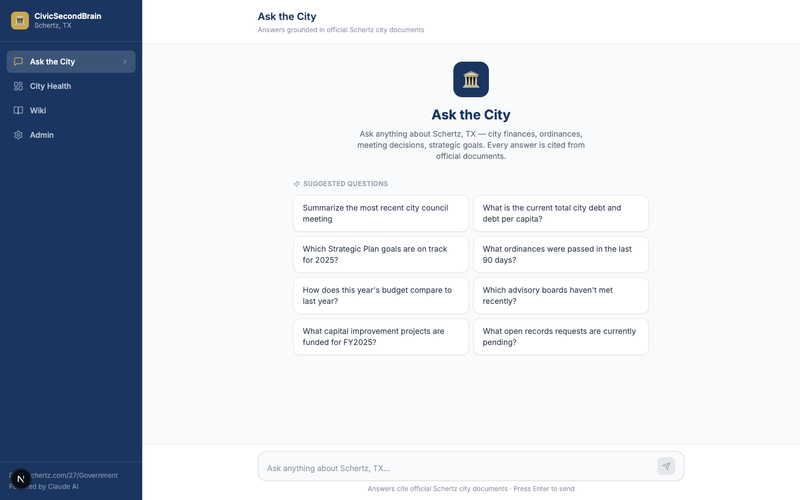
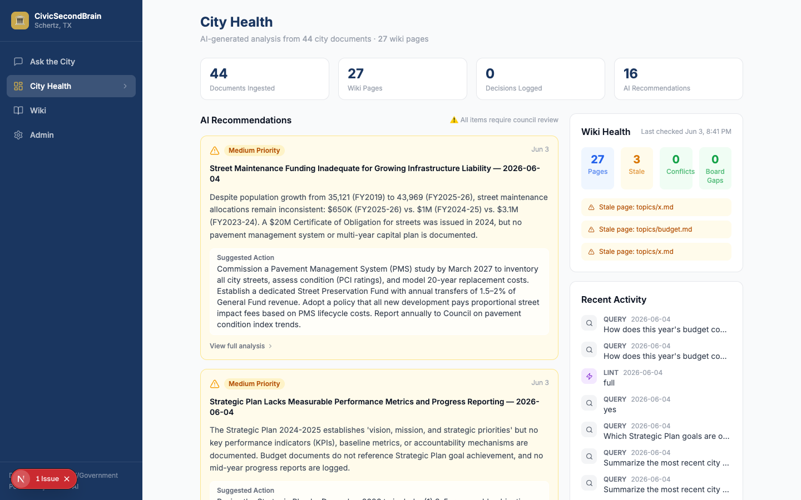
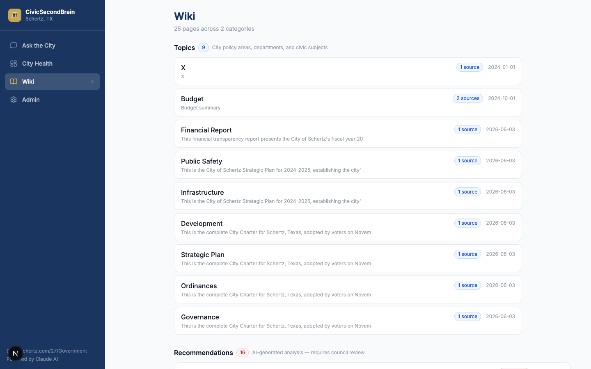
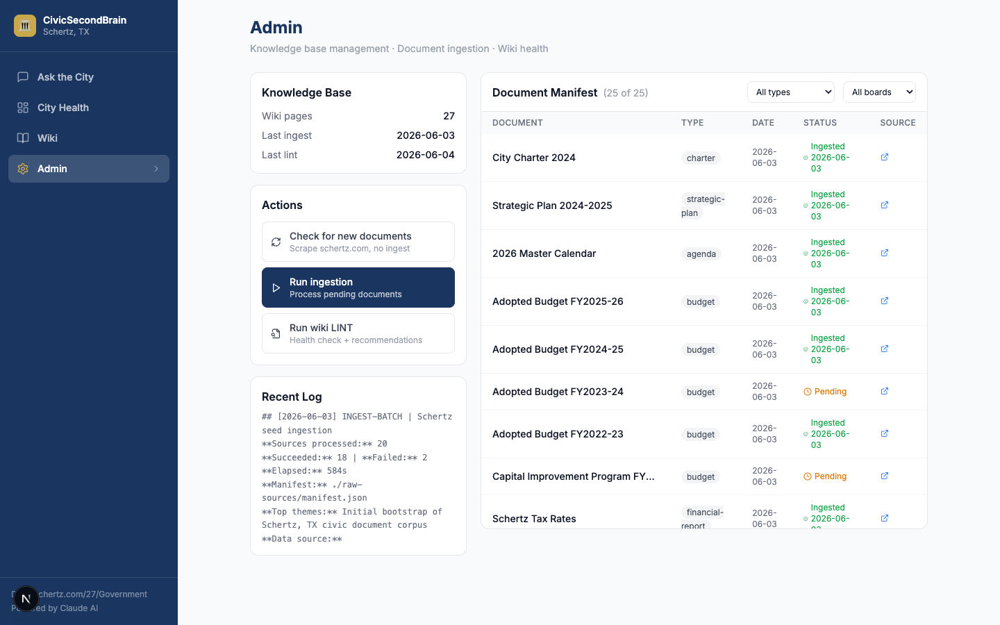

# CivicSecondBrain 🏛️
### AI-Powered City Council Knowledge Base

A persistent, AI-maintained knowledge base that gives City Council members
instant, cited answers about their city and proactive improvement recommendations.
Built on the [Karpathy LLM Wiki pattern](https://gist.github.com/karpathy/442a6bf555914893e9891c11519de94f).

> **Multi-city ready.** Every city name, scraper URL, and AI prompt is driven by
> environment variables — deploy for your municipality without touching the code.

---

## What It Does

| Feature | Description |
|---|---|
| **Chat Q&A** | Ask anything about the city in plain English — get cited answers from real city documents |
| **Persistent Wiki** | AI builds and maintains a structured wiki from every ingested document |
| **Smart Ingestion** | Parallel scrape of DocumentCenter, Laserfiche, Finance sub-pages, and MuniCode (~8,000+ documents), plus manual single-document ingest |
| **Proactive Recommendations** | AI analysis surfaces budget trends, strategic plan gaps, and improvement opportunities |
| **Meeting Briefing Packets** | Paste a published agenda URL — AI extracts the agenda items, cross-references each against the wiki, and writes a per-item briefing packet (background, past decisions, budget implications, open questions) |
| **City Health Dashboard** | At-a-glance view of civic KPIs and pending AI alerts |
| **Wiki Browser** | Browse all ingested wiki pages at `/wiki`, grouped by category |
| **Export** | Download recommendations or full wiki as Markdown or ZIP |
| **Multi-model AI** | Swap between Anthropic Claude, OpenAI GPT, or Google Gemini via a single env var |
| **Responsive UI** | Works on desktop, tablet, and phone — collapsible sidebar drawer on mobile |
| **Scheduled Automation** | Nightly ingest and weekly lint via Railway cron or GitHub Actions |
| **Admin Panel** | Password-protected ingestion management, manual document ingest (by URL or local file upload), export buttons, and schedule info |
| **Local File Upload** | Drag-and-drop or file-picker upload in the Admin panel — ingest PDFs, DOCX, XLSX, HTML, and TXT from your local machine without hosting them first |

---

## Screenshots

**Chat Q&A** — ask anything about the city, get cited answers from real documents



**City Health Dashboard** — AI recommendations and wiki health at a glance



**Wiki Browser** — browse all ingested pages by category



**Admin Panel** — manage document ingestion



---

## Architecture (Karpathy LLM Wiki Pattern)

```
Raw Sources (PDFs, HTML, ordinances)
    → INGEST (AI builds wiki pages)
    → QUERY  (AI answers from wiki, with citations)
    → LINT   (AI analyzes wiki, generates recommendations)
```

Three layers:
1. **`raw-sources/`** — immutable downloaded documents; `manifest.json` tracks what has been ingested
2. **`wiki/`** — AI-generated, persistent markdown knowledge base
3. **`app/`** — Next.js chat interface + API routes + dashboard

### AI Provider Abstraction

All three operations (INGEST, QUERY, LINT) go through a unified provider interface
(`app/lib/ai/provider.ts`). Set `AI_PROVIDER` to switch backends at deploy time:

| Provider | `AI_PROVIDER` | Default model |
|---|---|---|
| Anthropic Claude (default) | `anthropic` | `claude-sonnet-4-5` |
| OpenAI GPT | `openai` | `gpt-4o` |
| Google Gemini | `gemini` | `gemini-2.0-flash` |

---

## Quick Start

### Prerequisites
- Node.js 20+
- API key for your chosen AI provider (Anthropic, OpenAI, or Gemini)

### Setup

```bash
git clone https://github.com/xozai/CivicSecondBrain
cd CivicSecondBrain

npm install

cp .env.example .env.local
# Required: set at least one AI provider key
# ANTHROPIC_API_KEY=sk-ant-...   (default)
# OPENAI_API_KEY=sk-...          (if AI_PROVIDER=openai)
# GEMINI_API_KEY=...             (if AI_PROVIDER=gemini)

# Bootstrap the wiki with priority documents (fast)
npm run ingest:seed -- --limit 10

# Or bootstrap with all ~8,000 documents (takes 30-60 min)
npm run ingest:seed

# Generate AI recommendations
npm run lint:wiki

# Launch the app
npm run dev
```

Open [http://localhost:3000](http://localhost:3000)

---

## Scripts

| Command | Description |
|---|---|
| `npm run dev` | Start development server |
| `npm run build` | Production build |
| `npm run lint` | ESLint |
| `npm test` | Run unit tests (Vitest, 264 tests) |
| `npm run test:e2e` | Run Playwright e2e smoke tests (requires `npx playwright install chromium` once) |
| `npm run ingest:seed` | Full parallel ingestion from all sources (~8,000+ documents, 3 workers) |
| `npm run ingest:seed -- --limit 10` | Ingest first 10 documents (fast, no live scrape) |
| `npm run ingest:seed -- --type budget` | Ingest only budget documents (comma-separated for multiple: `--type budget,charter`) |
| `npm run ingest:seed -- --type budget,charter --since 2024-01-01` | Multiple types AND a date floor — only docs on or after the given date |
| `npm run ingest:seed -- --concurrency 5` | Use 5 parallel ingest workers (default 3) |
| `npm run ingest:doc -- --url <url>` | Ingest a single document by URL |
| `npm run lint:wiki` | Analyze wiki, generate AI recommendations for dashboard |
| `npm run scrape:check` | Check for new documents without ingesting |

> **Note:** When `--type`, `--limit`, `--board`, or `--since` flags are used, the full live scrape is skipped and only the curated priority seed list is used. Full scraping only runs with no flags.
>
> **Multiple types:** `--type` accepts a comma-separated list: `--type budget,charter,financial-report`. Pass `--since YYYY-MM-DD` to skip documents dated before that date.
>
> **Parallelism:** Discovery runs all scrapers concurrently. Ingest uses a configurable worker pool (`--concurrency N`, default 3). Tune to Railway memory: 512MB → 2 workers, 1GB → 3, 2GB → 5.
>
> **File size limit:** PDFs larger than `MAX_FILE_SIZE_MB` (default 25MB) are skipped before download. Set this env var to raise the limit on higher-memory deployments.

---

## Data Sources

Ingestion pulls from four sources automatically:

### 1. CivicPlus DocumentCenter (`schertz.com/DocumentCenter`)
Deep crawl via the internal `Document_AjaxBinding` JSON API. Covers:
- Budget & Finance (budgets, CIP, fee schedules, tax rates)
- Boards & Commissions, City Council, City Secretary
- Government, Public Information
- Planning, Parks & Recreation, Fire, EMS, Police

### 2. Laserfiche WebLink (`laserfiche.schertzweb.com`)
Recursive crawl of the public records archive via `FolderListingService.aspx`. Covers:
- City Council agendas & minutes (769+ documents)
- City Boards and Commissions agendas & minutes
- Finance Information, Resolutions, Ordinances
- Public Hearing and Public Notices, Public Publications
- Election Information, Charter Review Commission

### 3. Budget & Finance sub-pages
Direct scrape of Financial Transparency, Debt Obligations, City Pension, TMRS, and Public Notices pages.

### 4. MuniCode Ordinances (`library.municode.com`)
Crawls the city's published ordinance code via MuniCode's public Content Delivery API.
- Discovers all chapters and sections from the table of contents
- Downloads each section as HTML, parsed to plain text
- Maps to `DocumentType: "ordinance"` and ingested via the standard pipeline
- **Opt-in:** only runs when `MUNICODE_URL` is set (safe to leave blank)
- Configure via `MUNICODE_URL=https://library.municode.com/{state}/{city-slug}`

> **Note:** Board agendas are sourced exclusively from Laserfiche. The `/273/Agendas-Minutes` CivicPlus page links to Laserfiche and does not serve documents directly.

---

## Wiki Structure

```
wiki/                            ← Only seed files are committed to the repo
├── SCHEMA.md                    ← Governing document for wiki conventions (committed)
└── index.md                     ← Empty catalog template (committed, seed for first boot)
```

All generated content lives on the Railway persistent volume (`/data/wiki`) and is rebuilt by `ingest:seed` and `lint:wiki`. It is gitignored and never committed:

```
/data/wiki/                      ← Railway volume (not in repo)
├── log.md                       ← Append-only operation history
├── topics/                      ← Policy areas built from ingested documents
├── decisions/                   ← Per-meeting votes (YYYY-MM-DD-[board].md)
├── recommendations/             ← AI-generated analysis (requires council review)
└── queries/                     ← Saved Q&A answers
```

All wiki pages use YAML frontmatter (`title`, `type`, `category`, `sources`, `last_updated`) and inline `[SOURCE: filename, p.N]` citations. Financial figures always carry fiscal year context (`$4.2M FY2024`). Schertz fiscal year runs Oct 1 – Sep 30.

---

## App Routes

| Route | Description |
|---|---|
| `/` | Chat Q&A interface with suggested questions |
| `/wiki` | Browse all wiki pages by category |
| `/dashboard` | City health dashboard — KPIs and AI recommendations |
| `/admin` | Password-protected ingestion management, single-document ingest, and export |
| `/admin/login` | Admin login page |
| `GET /api/health` | Readiness check — returns 503 if API key is missing/invalid or wiki index not found |
| `GET /api/health/live` | Liveness probe — always returns 200 if the process is running (used by Railway healthcheck) |
| `POST /api/chat` | Streaming chat endpoint |
| `POST /api/ingest` | Trigger discovery ingest (requires `INGEST_SECRET`) |
| `POST /api/ingest/document` | Ingest one specific document URL without running discovery (requires `INGEST_SECRET`) |
| `POST /api/ingest/upload` | Ingest a local file uploaded as `multipart/form-data` — same pipeline as URL ingest (requires `INGEST_SECRET`) |
| `POST /api/lint` | Trigger wiki analysis (requires `INGEST_SECRET`) |
| `POST /api/briefing` | Generate a meeting briefing packet from an agenda URL (requires `INGEST_SECRET`) |
| `GET /api/wiki/search` | Full-text wiki search (`?q=query&category=topic&limit=50&offset=0` — `limit` defaults to 50, capped at 200; response includes `total`) |
| `GET /api/export/recommendations` | Export recommendations as `.md` or print-PDF HTML (requires admin session or `INGEST_SECRET`) |
| `GET /api/export/wiki` | Export full wiki as `.md` or `.zip` (requires admin session or `INGEST_SECRET`) |
| `GET /api/export/chat-log` | Export the chat Q&A audit log (`?month=YYYY-MM&format=jsonl\|csv`) for public-records requests (requires admin session or `INGEST_SECRET`) |
| `POST /api/admin/login` | Verify admin password, set session cookie |
| `POST /api/admin/logout` | Clear admin session cookie |

---

## Security

### Admin panel
`/admin` is protected by a password-based session cookie. Set `ADMIN_PASSWORD` in your Railway environment:

```bash
# Generate a strong password
openssl rand -base64 24
```

Without `ADMIN_PASSWORD`, the admin panel is open (dev mode only — always set in production).

The Admin panel supports scheduled ingestion and two manual single-document modes:

- **By URL** — paste an `http` or `https` document URL and optionally provide title, type, date, and board metadata. Downloads and ingests that one document without running the full discovery scrape.
- **Upload File** — drag-and-drop or browse (Finder/Explorer) to upload a local file directly. Accepts `.pdf`, `.html`, `.htm`, `.txt`, `.docx`, `.doc`, `.xlsx`, `.xls`. Files larger than `MAX_FILE_SIZE_MB` are rejected before saving. The file is saved to `RAW_SOURCES_PATH`, run through the same ingest engine, then deleted.

### API route auth
`/api/ingest`, `/api/ingest/document`, `/api/lint`, and `/api/briefing` require an `Authorization: Bearer <ingest-secret>` header matching `INGEST_SECRET`. Without `INGEST_SECRET`, requests are accepted in dev mode.

The export routes (`GET /api/export/wiki`, `GET /api/export/recommendations`) also require auth. They accept **either**:

- a valid `admin_session` cookie (log in at `/admin/login` — the admin panel's export links work automatically), **or**
- an `Authorization: Bearer <ingest-secret>` header matching `INGEST_SECRET`, for scripted exports:

```bash
curl -H "Authorization: Bearer $INGEST_SECRET" \
  "https://your-app.up.railway.app/api/export/wiki?format=zip" -o wiki.zip
```

If neither `ADMIN_PASSWORD` nor `INGEST_SECRET` is set, the export routes are open (dev mode only — always set both in production).

```bash
# Generate a secret
openssl rand -hex 32
```

`POST /api/ingest/document` accepts a manual single-document payload:

```json
{
  "url": "https://example.gov/document.pdf",
  "title": "Optional title",
  "type": "public-notice",
  "board": "city-council",
  "date": "2026-06-21"
}
```

The route accepts only `http` and `https` URLs. It validates the metadata, downloads that one document, runs the standard ingest engine, and saves the manifest only after a successful ingest. Download failures, unsupported formats, and AI ingest errors return JSON failure responses without updating the manifest.

`POST /api/briefing` generates a pre-meeting briefing packet from a published agenda:

```json
{
  "agendaUrl": "https://example.gov/agenda.pdf",
  "meetingDate": "2026-08-04",
  "board": "city-council"
}
```

`meetingDate` and `board` are optional — when omitted they are inferred from the agenda text. The route downloads and parses the agenda (deleting the temp file afterwards), extracts the agenda item list with one AI call, then cross-references each item against the wiki (same TF-IDF page selector as chat) and writes one brief per item — background, related past decisions/ordinances, budget implications with fiscal-year context, and open questions. The packet is saved to `wiki/briefings/YYYY-MM-DD-<board>-briefing.md`. Cost guards: max 25 items briefed per packet (noted in the output when truncated) and ~10k chars of wiki context per item.

### CI security
- `ANTHROPIC_API_KEY` is **not** passed to the CI build step (build confirmed clean without it)
- A lint step fails CI if any `NEXT_PUBLIC_ANTHROPIC` reference is found (prevents accidental browser bundle exposure)

---

## Environment Variables

Copy `.env.example` to `.env.local` for local development. In production set these in the Railway dashboard.

**Legend:** ★ Required in production &nbsp;|&nbsp; ○ Optional — has a safe default for local dev

---

### AI Provider

| Variable | ★/○ | Allowed values / format | Default |
|---|---|---|---|
| `AI_PROVIDER` | ○ | `anthropic` \| `openai` \| `gemini` | `anthropic` |
| `AI_MODEL` | ○ | Any valid model name string (leave blank for provider default) | *(see table below)* |
| `ANTHROPIC_API_KEY` | ★ if anthropic | `sk-ant-api03-...` | — |
| `OPENAI_API_KEY` | ★ if openai | `sk-proj-...` or `sk-...` | — |
| `OPENAI_BASE_URL` | ○ | Full URL, no trailing slash. e.g. `https://my-resource.openai.azure.com/openai/deployments/gpt-4o` | OpenAI default |
| `GEMINI_API_KEY` | ★ if gemini | `AIzaSy...` | — |

**Default model per provider:**

| `AI_PROVIDER` | Default `AI_MODEL` | When to override |
|---|---|---|
| `anthropic` | `claude-sonnet-4-5` | Use `claude-haiku-4-5` to reduce cost on large ingests |
| `openai` | `gpt-4o` | Use `gpt-4o-mini` for a lighter-weight / lower-cost option |
| `gemini` | `gemini-2.0-flash` | Use `gemini-1.5-pro` for longer context windows |

```bash
# Anthropic (default) — get key at console.anthropic.com
AI_PROVIDER=anthropic
ANTHROPIC_API_KEY=sk-ant-api03-...YOUR_KEY_HERE...AA

# OpenAI — get key at platform.openai.com/api-keys
AI_PROVIDER=openai
AI_MODEL=gpt-4o
OPENAI_API_KEY=sk-proj-...YOUR_KEY_HERE...

# Google Gemini — get key at aistudio.google.com/app/apikey
AI_PROVIDER=gemini
AI_MODEL=gemini-2.0-flash
GEMINI_API_KEY=AIzaSy...YOUR_KEY_HERE...
```

---

### City Identity

All UI strings, page titles, and AI system prompts read from these variables — no code changes required when deploying for a different city. **You only need to set the `NEXT_PUBLIC_` pair** — server-side code falls back to it automatically.

| Variable | ★/○ | Format / Example | Default |
|---|---|---|---|
| `NEXT_PUBLIC_CITY_NAME` | ○ | `"Schertz"` \| `"New Braunfels"` \| `"Austin"` | `"Schertz"` |
| `NEXT_PUBLIC_CITY_STATE` | ○ | Two-letter abbreviation: `"TX"` \| `"CA"` \| `"FL"` | `"TX"` |
| `CITY_NAME` | ○ | Optional server-side override for AI prompts — rarely needed | *(falls back to `NEXT_PUBLIC_CITY_NAME`)* |
| `CITY_STATE` | ○ | Optional server-side override for AI prompts — rarely needed | *(falls back to `NEXT_PUBLIC_CITY_STATE`)* |

```bash
# Schertz (default — no changes needed)
NEXT_PUBLIC_CITY_NAME="Schertz"
NEXT_PUBLIC_CITY_STATE="TX"

# Example: deploy for New Braunfels, TX
NEXT_PUBLIC_CITY_NAME="New Braunfels"
NEXT_PUBLIC_CITY_STATE="TX"
```

**Why two pairs exist:** Next.js inlines `NEXT_PUBLIC_` variables into the client bundle at **build time** — that is what the browser UI shows, so make sure the pair is set when `next build` runs (Railway exposes service variables during Docker builds automatically). Server code (AI prompts, scraper logs) reads the environment at **runtime** and uses `CITY_NAME`/`CITY_STATE` if set, falling back to the `NEXT_PUBLIC_` pair. Setting both pairs to different values logs a startup warning, since the UI and the AI prompts would disagree about the city name.

---

### Scraper Configuration

| Variable | ★/○ | Format / Example | Default |
|---|---|---|---|
| `CIVICPLUS_URL` | ○ | Full CivicPlus section URL. Format: `https://{city}/{folder-id}/Government` | `https://www.schertz.com/27/Government` |
| `LASERFICHE_URL` | ○ | Laserfiche WebLink base URL — the host serving `/WebLink/Browse.aspx` | `https://laserfiche.schertzweb.com` |
| `GOV_BASE_URL` | ○ | Explicit root URL of city website, no trailing slash. Overrides the root derived from `CIVICPLUS_URL` | *(derived from `CIVICPLUS_URL`)* |
| `MUNICODE_URL` | ○ | Full MuniCode URL including code slug (see below). Leave blank to disable | *(disabled)* |
| `MAX_FILE_SIZE_MB` | ○ | Integer: `25` \| `50` \| `100` | `25` |

> **Deprecated names:** `SCHERTZ_GOV_URL` and `SCHERTZ_LASERFICHE_URL` still work as aliases for `CIVICPLUS_URL` and `LASERFICHE_URL`, but log a deprecation warning at startup and will be removed in a future major release. Rename them in your deployment.

**`MUNICODE_URL`** — enables the MuniCode ordinance scraper. Leave blank to skip gracefully (other scrapers continue). The URL must include the full path with the code slug:

```bash
# Schertz, TX
MUNICODE_URL=https://library.municode.com/tx/schertz/codes/code_of_ordinances

# URL format for other cities:
# https://library.municode.com/{state-abbrev}/{city-slug}/codes/{code-slug}
#
# Examples:
# New Braunfels, TX: https://library.municode.com/tx/new_braunfels/codes/code_of_ordinances
# Cedar Park, TX:    https://library.municode.com/tx/cedar_park/codes/code_of_ordinances
# Round Rock, TX:    https://library.municode.com/tx/round_rock/codes/code_of_ordinances
```

**`MAX_FILE_SIZE_MB`** — PDFs larger than this are skipped before download (checked via HTTP HEAD, no wasted bandwidth). Tune to your Railway plan:

```bash
MAX_FILE_SIZE_MB=25    # 512 MB RAM — default
MAX_FILE_SIZE_MB=50    # 1 GB RAM
MAX_FILE_SIZE_MB=100   # 2 GB RAM
```

---

### Security

Both secrets **must be set in production**. Without them `/admin` and the ingest API are publicly accessible to anyone who knows the URL.

| Variable | ★/○ | Format / How to generate | Default (dev) |
|---|---|---|---|
| `ADMIN_PASSWORD` | ★ production | Any string — use a strong random value. `openssl rand -base64 24` | Open — no auth |
| `INGEST_SECRET` | ★ production | Any string — use a strong random value. `openssl rand -hex 32` | Open — no auth |
| `CHAT_RATE_LIMIT_RPM` | ○ | Positive integer: `20` \| `60` | `20` |

```bash
# Generate in your terminal and paste into Railway dashboard:
openssl rand -base64 24   # use this as ADMIN_PASSWORD
openssl rand -hex 32      # use this as INGEST_SECRET

# Example (generate your own — never reuse these):
ADMIN_PASSWORD=Jk9mPqR2vXnL4sYw8tBcDe3A
INGEST_SECRET=a3f1c8e2d9b04765f2a8c1e3d6b90f4e2c7a1d5b8e3f6c9a2d4b7e0f1c3a6d9
```

**`ADMIN_PASSWORD`** protects `/admin` with a login page. The session cookie is HMAC-SHA256 signed, HttpOnly, SameSite=Lax, and expires after 8 hours. Changing the password immediately invalidates all existing sessions.

**`INGEST_SECRET`** — callers must send `Authorization: Bearer <ingest-secret>` to `POST /api/ingest`, `POST /api/ingest/document`, `POST /api/ingest/upload`, `POST /api/lint`, and `POST /api/briefing`. The GitHub Actions scheduled workflow reads this from repository secrets.

**`CHAT_RATE_LIMIT_RPM`** — max `POST /api/chat` requests per minute per client IP. Every chat request triggers a paid AI API call, so this caps the cost impact of crawl bursts or abuse. Requests over the limit get an HTTP 429 with a `Retry-After` header (the chat UI shows a friendly retry message). The limiter is an in-memory sliding window keyed by the first hop of `x-forwarded-for` — sufficient because the Railway deployment runs a single replica; a multi-replica deployment would need a shared store (Redis/Upstash).

---

### Storage Paths

| Variable | ★/○ | Format / Example | Default |
|---|---|---|---|
| `WIKI_PATH` | ○ | Absolute path. Railway: `/data/wiki` | `./wiki` |
| `RAW_SOURCES_PATH` | ○ | Absolute path. Railway: `/data/raw-sources` | `./raw-sources` |
| `CHAT_LOG_PATH` | ○ | Absolute path. Railway: `/data/chat-log` | Sibling of `WIKI_PATH` (`./chat-log`) |

```bash
# Railway production (volume mounted at /data)
WIKI_PATH=/data/wiki
RAW_SOURCES_PATH=/data/raw-sources

# Local development — defaults work, no need to set these
```

**`CHAT_LOG_PATH`** — directory for the chat Q&A audit log (public-records compliance). Every `POST /api/chat` turn is appended to a monthly `YYYY-MM.jsonl` file recording the timestamp, question, full answer, wiki pages used as context, provider/model, and latency. Raw client IPs are never logged. Defaults to a sibling of the wiki directory, so on Railway (`WIKI_PATH=/data/wiki`) it lands on the persistent volume at `/data/chat-log` with no extra configuration. Export it from the admin panel's Export card or directly via `GET /api/export/chat-log?month=YYYY-MM&format=jsonl|csv`.

---

### Complete Setup Examples

**Schertz, TX — Anthropic Claude (production)**

```bash
# AI
AI_PROVIDER=anthropic
ANTHROPIC_API_KEY=sk-ant-api03-...YOUR_KEY_HERE...AA

# City
NEXT_PUBLIC_CITY_NAME="Schertz"
NEXT_PUBLIC_CITY_STATE="TX"

# Scrapers
MUNICODE_URL=https://library.municode.com/tx/schertz/codes/code_of_ordinances
MAX_FILE_SIZE_MB=25

# Security (generate your own values)
ADMIN_PASSWORD=<output of: openssl rand -base64 24>
INGEST_SECRET=<output of: openssl rand -hex 32>

# Storage (Railway volume)
WIKI_PATH=/data/wiki
RAW_SOURCES_PATH=/data/raw-sources
```

**Another City — OpenAI GPT-4o (production)**

```bash
# AI
AI_PROVIDER=openai
AI_MODEL=gpt-4o
OPENAI_API_KEY=sk-proj-...YOUR_KEY_HERE...

# City
NEXT_PUBLIC_CITY_NAME="New Braunfels"
NEXT_PUBLIC_CITY_STATE="TX"

# Scrapers
GOV_BASE_URL=https://www.newbraunfels.gov
MUNICODE_URL=https://library.municode.com/tx/new_braunfels/codes/code_of_ordinances
MAX_FILE_SIZE_MB=50

# Security (generate your own values)
ADMIN_PASSWORD=<output of: openssl rand -base64 24>
INGEST_SECRET=<output of: openssl rand -hex 32>

# Storage (Railway volume)
WIKI_PATH=/data/wiki
RAW_SOURCES_PATH=/data/raw-sources
```

---


## Multi-City Deployment

CivicSecondBrain is designed to work with any CivicPlus municipality. To deploy for a different city:

1. Set `NEXT_PUBLIC_CITY_NAME` and `NEXT_PUBLIC_CITY_STATE` (server-side prompts fall back to these — no need to duplicate them into `CITY_NAME`/`CITY_STATE`)
2. Set `CIVICPLUS_URL` to the city's CivicPlus "Government" section URL, or `GOV_BASE_URL` to the site root (e.g. `https://www.newbraunfels.gov`)
3. Set `MUNICODE_URL` if the city publishes ordinances on MuniCode
4. Set `LASERFICHE_URL` to the city's Laserfiche WebLink base URL — but note the repo name and folder IDs in `laserfiche-scraper.ts` are still Schertz-specific and need updating for a different Laserfiche instance

---

## Cloud Deployment (Railway)

The app is deployed on [Railway](https://railway.app) using Docker.

### Quick Deploy

```bash
# Install Railway CLI
brew install railway

# Link to your project
railway login && railway init

# Set environment variables in Railway dashboard (see above)

# Railway auto-deploys on every push to main
```

### Architecture

| Component | Setup |
|---|---|
| App hosting | Railway (Dockerfile, persistent `/data` volume) |
| Wiki storage | Railway volume at `/data/wiki` |
| Raw sources | Railway volume at `/data/raw-sources` |
| Nightly ingest | Railway cron: `node ... scripts/ingest-seed.ts --limit 50` at `0 8 * * *` (UTC) |
| Weekly lint | Railway cron: `node ... scripts/lint-wiki.ts` at `0 9 * * 0` (UTC) |
| Healthcheck | `GET /api/health/live` (liveness, always 200) + `GET /api/health` (readiness, 503 on degraded) |

### Scheduled Automation

Railway cron jobs are defined in `railway.toml` and run inside the container (no HTTP server dependency):

```toml
[[cron]]
schedule = "0 8 * * *"    # nightly 2am CT
command  = "node ... scripts/ingest-seed.ts --limit 50"

[[cron]]
schedule = "0 9 * * 0"    # Sunday 3am CT
command  = "node ... scripts/lint-wiki.ts"
```

A GitHub Actions fallback (`.github/workflows/scheduled.yml`) is also provided for non-Railway deployments. It calls the API endpoints on the same schedule using repository secrets `APP_URL` and `INGEST_SECRET`.

### First Boot

On first deploy, Railway mounts an empty volume at `/data`. The container auto-initializes `wiki/SCHEMA.md` and `wiki/index.md` on startup. Then seed the wiki from the Railway shell:

```bash
railway run npm run ingest:seed -- --limit 10   # quick start
railway run npm run lint:wiki                    # generate recommendations
```

### Disk & Memory Management

- **PDFs >25MB** are skipped before download via HTTP HEAD
- **Downloaded files are deleted** immediately after successful ingest — `/data/raw-sources/` stays near-empty
- **Change detection** — already-ingested docs are skipped unless `Last-Modified` or `ETag` changed
- **Memory** — ingest runs with `--max-old-space-size=768`. If OOM errors occur, increase Railway memory to 1GB

---

## Reliability

### Document parsing
- **PDF:** `pdf-parse` up to `MAX_FILE_SIZE_MB` (default 25MB)
- **DOCX / DOC:** `mammoth` for real text extraction (previously returned blank content — now fully parsed)
- **XLSX / XLS:** `SheetJS` with sheet name headers and tab-delimited cell data
- **HTML:** `cheerio` with nav/sidebar/footer removal
- **Unsupported formats** are skipped without calling the AI — no blank wiki pages

### Chat page selection (TF-IDF)
The chat endpoint uses TF-IDF cosine similarity to select the most relevant wiki pages for each query — replacing the previous hardcoded keyword map. Works across any topic without configuration, and falls back to topic pages for broad queries. Decision pages are boosted for temporal queries ("last meeting", "recent vote").

### YAML auto-repair
Wiki pages with unquoted colons or pipe characters in their YAML frontmatter are automatically repaired on first read.

### Manifest safety
- **Race condition fix:** `saveManifest()` is called once after the full ingest loop (not per-document) behind a module-level concurrency mutex — concurrent API requests return 409
- **Checksum dedup:** runs after download (not before), so `localPath` is always available for hashing

### Health check
`GET /api/health` performs a live probe of the AI provider API (not just an env-var presence check) to catch revoked or invalid keys before they cause silent failures.

---

## Export

| Format | Endpoint | Description |
|---|---|---|
| Recommendations (Markdown) | `GET /api/export/recommendations?format=md` | All current recommendations as a council-packet-ready `.md` file |
| Recommendations (Print PDF) | `GET /api/export/recommendations?format=pdf` | Print-optimized HTML — use browser Print → Save as PDF |
| Full wiki (Markdown) | `GET /api/export/wiki?format=md` | All wiki pages concatenated, grouped by category |
| Full wiki (ZIP) | `GET /api/export/wiki?format=zip` | All wiki `.md` files in a DEFLATE-compressed ZIP archive |

Export buttons are available in the Admin panel under the **Export** card.

---

## CI/CD

GitHub Actions runs on every push to `main` and every PR:
- `npm test` — 157 Vitest unit tests across 16 test files
- `npm run build` — validates the Next.js production build
- Lint check — fails if `NEXT_PUBLIC_ANTHROPIC` appears anywhere in source
- `npm run test:e2e` (separate **E2E** workflow) — Playwright smoke tests against a real production build: `/`, `/wiki`, `/dashboard`, the `/admin` auth-gate redirect, and `GET /api/health/live`. No AI calls — runs entirely without `ANTHROPIC_API_KEY`.

`ANTHROPIC_API_KEY` is intentionally **not** passed to the build step — the build is confirmed clean without it.

Railway's **"Wait for CI"** setting ensures deploys only happen after tests pass.

---

## Tech Stack

- **Framework:** Next.js 16 (App Router, Server Components)
- **AI:** Provider-agnostic (`app/lib/ai/provider.ts`) — Anthropic Claude, OpenAI GPT, or Google Gemini
- **Scraping:** Axios + Cheerio + custom CivicPlus DocumentCenter, Laserfiche, and MuniCode API clients
- **Document Parsing:** pdf-parse (PDF), mammoth (DOCX), SheetJS (XLSX), cheerio (HTML)
- **Page Selection:** TF-IDF cosine similarity scorer (zero deps, replaces hardcoded keyword map)
- **Styling:** Tailwind CSS (dark mode, responsive)
- **Testing:** Vitest (157 unit tests — wiki, parser, scraper, AI provider, admin auth, export)
- **Auth:** HMAC-SHA256 signed session cookie (admin panel), Bearer token (API routes)
- **Deployment:** Docker on Railway with persistent volume + cron jobs
- **CI:** GitHub Actions
- **Language:** TypeScript

---

## License

Copyright (c) 2024 Jose Leos. All rights reserved.

This software is proprietary and confidential. Unauthorized use, copying,
distribution, or modification is strictly prohibited. See [LICENSE](LICENSE) for details.
